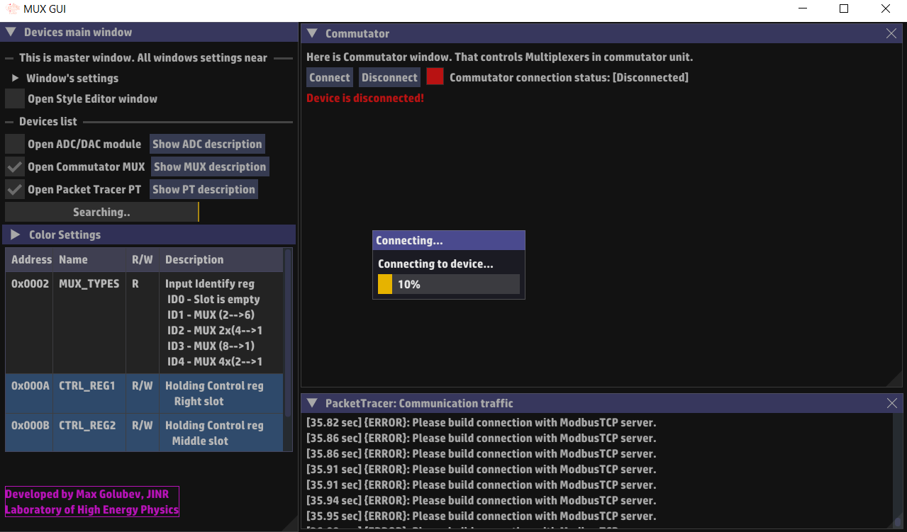
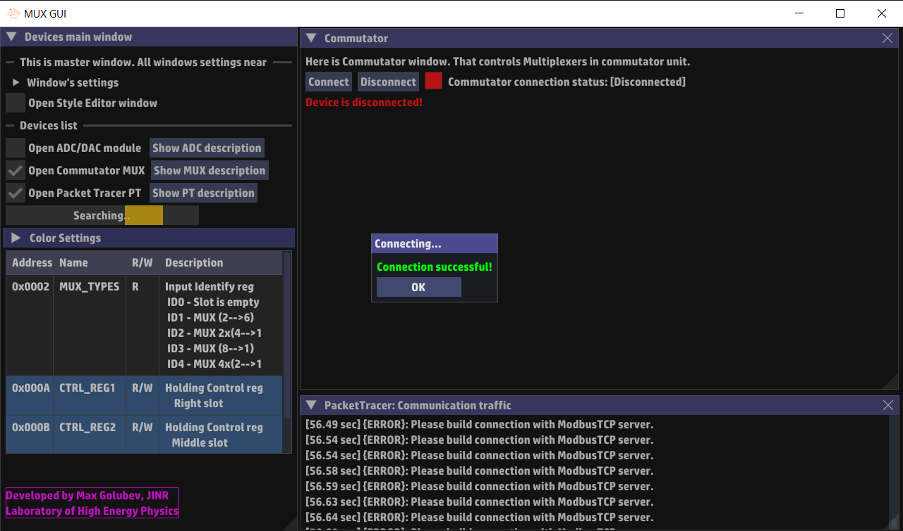
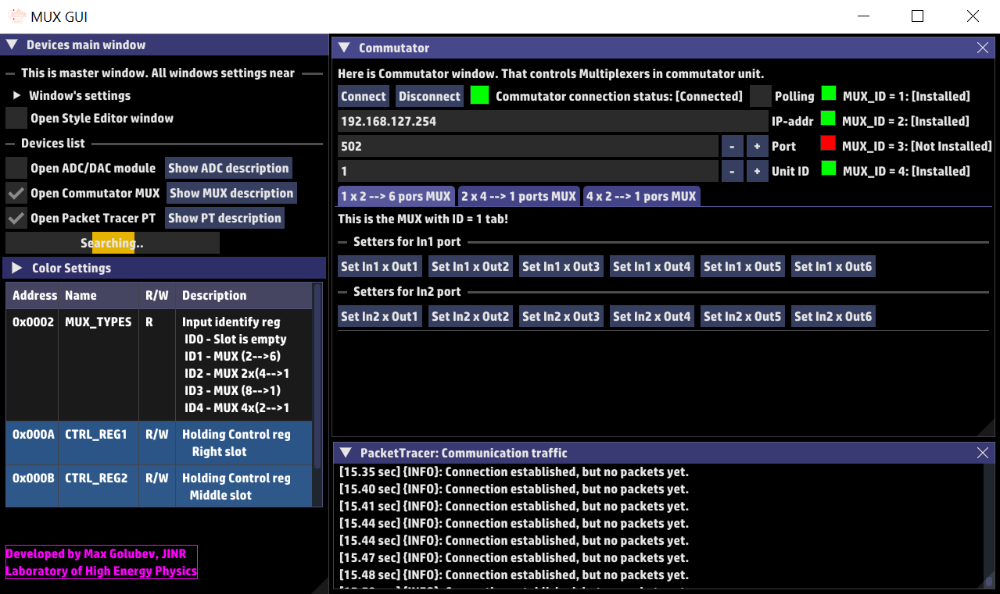
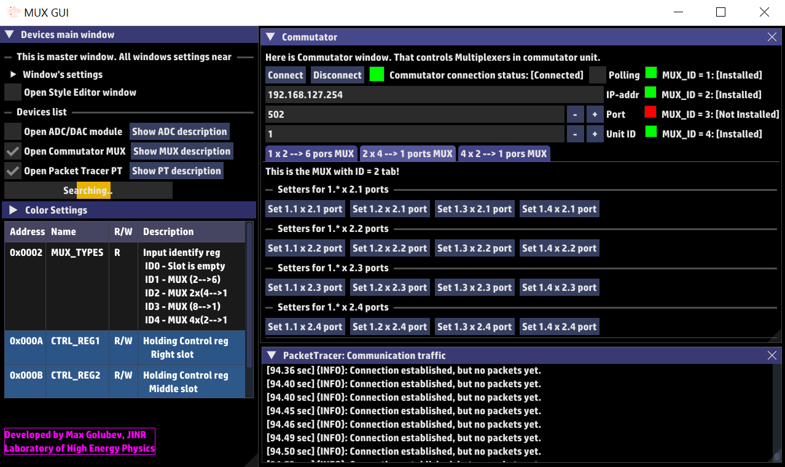
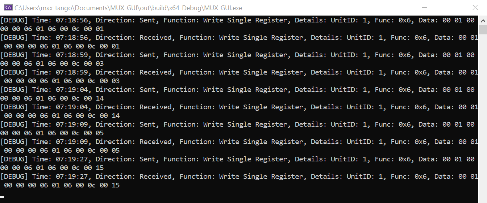

# Multiplexer GUI (MUX GUI)
_________________________________________________________________________________

## Requirements

<p align=left> $${\color{green}For \space execution: }$$
- OS Windows 10 </p><br>

<p align=left>$${\color{green}For \space development: }$$
- MSVC Compiler 14.39; WinCMake 3.31.2 </p>

## Libraries

- [ImGui](https://github.com/ocornut/imgui)
- [ImPlot](https://github.com/epezent/implot)
- [GLFW3](https://www.glfw.org/)
- [OpenGL3](https://www.opengl.org/)
- [ModbusTCP](https://www.simplymodbus.ca/TCP.htm)

## Documentation
See information about ModbusTCP library and compapitable devices:<br>
[Backends](./docs/BACKENDS.md) <br>
[Devices](./docs/DEVICES.md) <br>

## Installation

### Windows Installer
1. Go to [my JINR-GitLab releases page](https://git.jinr.ru/SanchezRIwork/MUX_GUI/-/releases)
2. Download Windows installer: ***MUX_GUI_[version]_setup.exe***
3. Install to directory which doesn't have any spaces:
   - Example: ``` C:/tango_projects/MUX_GUI```
### Building from source
1. Go to my remote repository [MUX_GUI](https://git.jinr.ru/SanchezRIwork/MUX_GUI/-/tree/master?ref_type=heads) and choose required branch:
   - ***master***: main branch, stable release of app
   - ***develop***: bug main fixes, testing, development
   - ***pre-release***: optimization, testing, pre-release of application <br>
   _You also can see release tags (Example **v1.0.0-alpha**)_
2. Clone repository with command ```git clone <repos URL>```
3. Open ```Visual Studio 2022``` -> ```Open Folder``` -> ```path/to/MUX_GUI```
4. Click ```Build``` -> ```Build All``` (If you have problem, regenerate CMake)
5. Go to ```MUX_GUI/out/build/x64-{Release}{Debug}/``` and execute ```MUX_GUI.exe```

## Using

### Getting Started
1. Run ***MUX_GUI.exe***
2. Manage and control your device (or devices)!

### UserFlow
1. Connect your device to PoE-Switch
2. Click on "Connect" button
3. Change IP-address, port-number and UnitID if this necessary
4. Browse for your MUX below basic parameters
5. Change ports by clicking on relevant buttons
6. When done with device, click on "Disconnect" and close the program

## Gallery

Here is GUI for Commutator Device [Connection Popup 1]:<br>
<br>
Here is GUI for Commutator Device [Connection Popup 2]:<br>
<br>
Here is GUI for Commutator Device [MUX (2 &rarr; 6)]:<br>
<br>
Here is GUI for Commutator Device [MUX 2x(4 &rarr; 1)]:<br>
<br>
Packets between Commutator Device and Master Device:<br>
<br>

## Bugs
Here is color management for **_Bug Types_**:
- $${\color{red}RED - Blocker }$$
- $${\color{orange}ORANGE - Critical}$$
- $${\color{yellow}YELLOW - Major }$$
- $${\color{green}GREEN - Minor }$$

Here is color management for **_Fix Statuses_**:
- $${\color{red}RED - just \space found \space bug. \space No \space ideas \space for \space resolving }$$
- $${\color{aqua}AQUA - resolving \space bug. \space Have \space multiple \space solutions \space for \space resolving \space bug. }$$
- $${\color{green}GREEN - after \space testing, bug \space is \space resolved }$$

|Date|Bug Name|Bug Type|Description|Fix Ways|Fix Status|Fix Description|
|----|--------|--------|-----------|--------|----------|---------------|
|29/05/2025|Render blaming|$${\color{orange}Critical }$$| While connection isn't estabilished, app doesn't respond| Add Progress bar to render |$${\color{aqua}In \space Progress}$$|Add additional popup, but with syncronization problem|
|30/06/2025|PT doesn't display all packets|$${\color{yellow}Major}$$|Communication packets doesn't display on the window only in debug terminal|?|$${\color{red}Found}$$|Nothing to describe|
|02/07/2025|Wrong connection status on popup|$${\color{orange}Critical}$$|GUI displayed wrong successful connection to device|Check logic of connection on frontend|$${\color{green} Resolved}$$|Add new if-else block to **_comm_modbus.connect()_**|
|09/07/2025|Popup Thread error|$${\color{red}Blocker }$$|GUI displayed wrong connection status - disconnected even connection was successful!|?|$${\color{red} Found}$$|?|
|09/07/2025|Defaut font displayed|$${\color{green}Minor}$$|Default font displayed while app installed and executed on another PC|Change automated location path in **RenderSystem.cpp**|$${\color{aqua}In \space Progress}$$|After building just resolve to installation path|